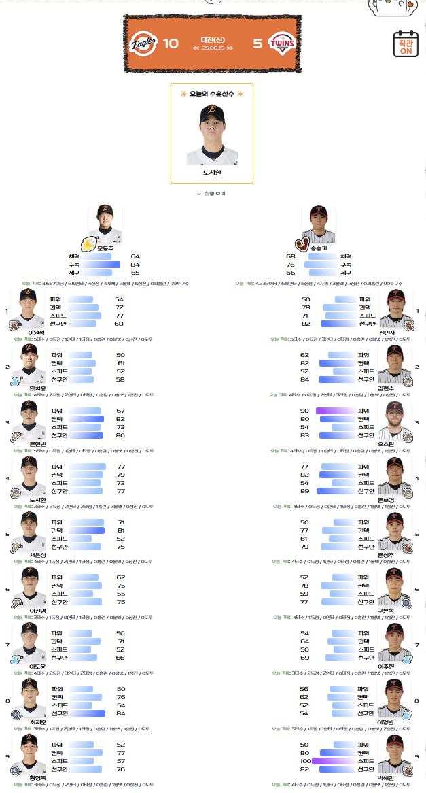
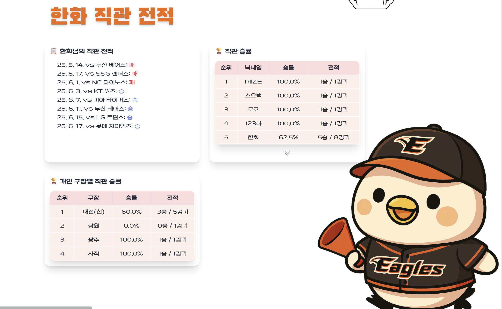
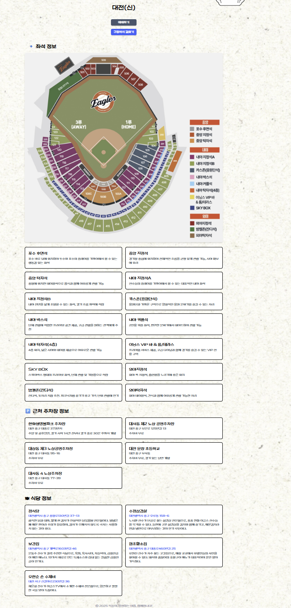
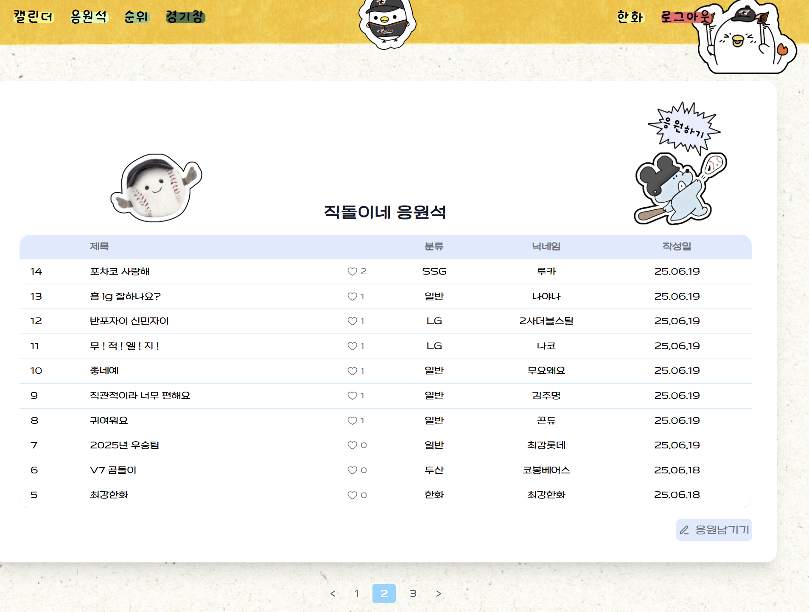
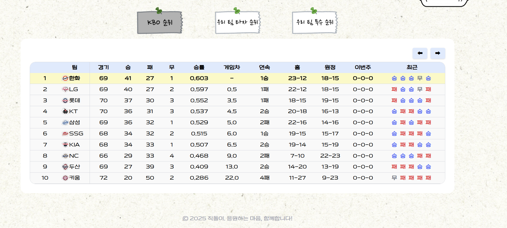

# [직돌이](http://ec2-13-209-80-237.ap-northeast-2.compute.amazonaws.com/)

최근 야구에 대한 관심이 높아지고 있지만, 직관을 가기 위해 필요한 정보가 부족한 경우가 많다. 특히 야구에 새로 입문한 팬들은 어떤 경기를 가야 하는지, 어떤 선수가 나오는지, 구장까지 어떻게 가야 하는지 등 다양한 정보를 일일이 찾아야 하는 번거로움이 있다. 직관 후에도 선수에 대한 이해 부족으로 인해 관람의 재미가 반감되기도 한다. 이런 점을 해결하기 위해 직관에 필요한 모든 정보를 한눈에 볼 수 있는 서비스를 기획하게 되었다.

---
## 데이터 처리 스크립트
- [데이터 수집 및 가공](https://github.com/dayofbaseball/KBO/tree/master/data/make_stat)
- [DB 저장 커맨드](https://github.com/dayofbaseball/KBO/tree/master/cal/management/commands)
- 스크립트 : `ready_develop.sh`, `local_before_game_schedule.py`, `local_before_game.sh`, `local_after_game.sh`, `server_before_game_schedule.py`, `server_before_game.sh`, `server_after_game.sh`
- crontab
    - local
    - server

### `ready_develop.sh`
```bash
# 첫 사용 때 씀
python manage.py makemigrations
python manage.py migrate

python data/make_stat/00_hitters_stats.py 
python data/make_stat/01_pitchers_stats.py 
python data/make_stat/02_get_velocity.py 
python data/make_stat/03_preprocessing.py 
python data/make_stat/04_player_style.py 
python data/make_stat/05_kbo_schedule.py 
python data/make_stat/06_lineup.py 
python data/make_stat/07_hitters_daily_stat.py 
python data/make_stat/08_pitchers_daliy_stat.py 

python manage.py stadium
python manage.py games
python manage.py hitters
python manage.py pitchers
python manage.py lineup
python manage.py parking
python manage.py seats
python manage.py restaurant
python manage.py daily_hitter_stat
python manage.py daily_pitcher_stat
```

### `local_before_game_schedule.py`
```python
import csv
from datetime import datetime, timedelta
import subprocess

# 파일 경로 설정
CSV_PATH = "/mnt/c/Users/<username>/KBO/data/kbo_schedule.csv"
SCRIPT_PATH = "/mnt/c/Users/<username>/KBO/local_before_game.sh"
LOG_PATH = "/mnt/c/Users/<username>/KBO/schedule_checker.log"
BEFORE_GAME_LOG = "/mnt/c/Users/<username>/KBO/before_game.log"

# 현재 시간
now = datetime.now()
today_str = now.strftime("%Y.%m.%d")

# 로그 기록 함수
def log(message):
    with open(LOG_PATH, "a", encoding="utf-8") as f:
        f.write(f"[{now.strftime('%Y-%m-%d %H:%M:%S')}] {message}\n")

log("스케줄 체크 시작")

# CSV 파일 열어서 오늘 날짜에 해당하는 경기 찾기
with open(CSV_PATH, newline='', encoding='utf-8-sig') as csvfile:
    reader = csv.reader(csvfile)
    for row in reader:
        if len(row) >= 2 and row[0] == today_str:
            game_time_str = row[1]  # 경기 시간 문자열
            datetime_str = today_str.replace('.', '-') + " " + game_time_str
            game_datetime = datetime.strptime(datetime_str, "%Y-%m-%d %H:%M")

            # 경기 시작 55분 전 시간 계산
            run_time = game_datetime - timedelta(minutes=55)
            run_time_str = run_time.strftime("%H:%M")

            # at 명령어로 스크립트 예약 실행
            cmd = f'echo "sh \\"{SCRIPT_PATH}\\" >> \\"{BEFORE_GAME_LOG}\\" 2>&1" | at {run_time_str}'
            subprocess.run(cmd, shell=True)

            log(f"before_game.sh 예약됨: {run_time_str} (경기시간: {game_time_str})")
            break
    else:
        log(f"오늘 경기 없음 (날짜: {today_str})")

```

### `local_before_game.sh`
```bash
source /mnt/c/Users/<username>/KBO/uvenv/bin/activate

python /mnt/c/Users/<username>/KBO/data/make_stat/06_lineup.py

git add /mnt/c/Users/<username>/KBO/data/lineups.csv

git commit -m '데이터 추가'

git push origin master
```

### `local_after_game.sh`
```bash
source ~/KBO/uvenv/bin/activate

python /mnt/c/Users/<username>/KBO/data/make_stat/00_hitters_stats.py
python /mnt/c/Users/<username>/KBO/data/make_stat/01_pitchers_stats.py 
python /mnt/c/Users/<username>/KBO/data/make_stat/02_get_velocity.py 
python /mnt/c/Users/<username>/KBO/data/make_stat/03_preprocessing.py 
python /mnt/c/Users/<username>/KBO/data/make_stat/04_player_style.py 
python /mnt/c/Users/<username>/KBO/data/make_stat/05_kbo_schedule.py 
python /mnt/c/Users/<username>/KBO/data/make_stat/07_hitters_daily_stat.py 
python /mnt/c/Users/<username>/KBO/data/make_stat/08_pitchers_daliy_stat.py 

git add /mnt/c/Users/<username>/KBO/data/all_hitter_stats.csv
git add /mnt/c/Users/<username>/KBO/data/all_pitcher_stats.csv
git add /mnt/c/Users/<username>/KBO/data/hitters_records.csv
git add /mnt/c/Users/<username>/KBO/data/kbo_schedule.csv
git add /mnt/c/Users/<username>/KBO/data/pitchers_records.csv

git commit -m '데이터 추가'

git push origin master
```

### `server_before_game_schedule.py`
```python
import csv
from datetime import datetime, timedelta
import subprocess

# 파일 경로 설정
CSV_PATH = "/home/ubuntu/<project_name>/data/kbo_schedule.csv"
SCRIPT_PATH = "/home/ubuntu/<project_name>/before_game.sh"
LOG_PATH = "/home/ubuntu/<project_name>/schedule_checker.log"
BEFORE_GAME_LOG = "/home/ubuntu/<project_name>/before_game.log"

# 현재 날짜 (형식: 2025.06.27)
now = datetime.now()
today_str = now.strftime("%Y.%m.%d")

# 로그 기록 함수
def log(message):
    with open(LOG_PATH, "a", encoding="utf-8") as f:
        f.write(f"[{now.strftime('%Y-%m-%d %H:%M:%S')}] {message}\n")

log("스케줄 체크 시작")

# 스케줄 파일 읽기
with open(CSV_PATH, newline='', encoding='utf-8-sig') as csvfile:
    reader = csv.reader(csvfile)
    for row in reader:
        # 오늘 날짜에 해당하는 경기 정보 찾기
        if len(row) >= 2 and row[0] == today_str:
            game_time_str = row[1]  # 경기 시작 시각 (HH:MM)
            datetime_str = today_str.replace('.', '-') + " " + game_time_str
            game_datetime = datetime.strptime(datetime_str, "%Y-%m-%d %H:%M")

            # 경기 시작 50분 전으로 예약 시간 계산
            run_time = game_datetime - timedelta(minutes=50)
            run_time_str = run_time.strftime("%H:%M")

            # before_game.sh 스크립트를 예약 실행
            cmd = f'echo "sh \\"{SCRIPT_PATH}\\" >> \\"{BEFORE_GAME_LOG}\\" 2>&1" | at {run_time_str}'
            subprocess.run(cmd, shell=True)

            log(f"before_game.sh 예약됨: {run_time_str} (경기시간: {game_time_str})")
            break
    else:
        log(f"오늘 경기 없음 (날짜: {today_str})")

```

### `server_before_game.sh`
```bash
#!/bin/bash

source /home/ubuntu/<project_name>/venv/bin/activate

cd /home/ubuntu/<project_name>

git pull origin master

python manage.py lineup

sudo systemctl restart nginx
sudo systemctl restart uwsgi

```

### `server_after_game.sh`
```bash
#!/bin/bash

source /home/ubuntu/<project_name>/venv/bin/activate

cd /home/ubuntu/<project_name>

git pull origin master

python /home/ubuntu/<project_name>/manage.py games
python /home/ubuntu/<project_name>/manage.py hitters
python /home/ubuntu/<project_name>/manage.py pitchers
python /home/ubuntu/<project_name>/manage.py daily_hitter_stat
python /home/ubuntu/<project_name>/manage.py daily_pitcher_stat

sudo systemctl restart nginx
sudo systemctl restart uwsgi

```

### `local_crontab`
```bash
0 0 * * * /bin/bash /mnt/c/Users/<username>/KBO/after_game.sh >> /mnt/c/Users/<username>/KBO/after_game.log 2>&1


0 11 * * * /mnt/c/Users/<username>/KBO/uvenv/bin/python3 /mnt/c/Users/<username>/KBO/before_game_schedule.py
```

### `server_crontab`
```bash
30 0 * * * /bin/bash /home/ubuntu/<project_name>/after_game.sh >> /home/ubuntu/<project_name>/after_game.log 2>&1

0 11 * * * /home/ubuntu/.pyenv/shims/python3 /home/ubuntu/<project_name>/before_game_schedule.py
```

## 프로젝트 구조

- cal : 경기 일정 및 경기별 상세정보
- accounts : 계정 관리
- posts : 응원글 게시판
- jikdoltest : 유저의 직관 유형 테스트
- data : 데이터 수집/가공
- templates : base.html 기반 관리
- static : 공통 정적 파일 관리

---

## 사용자 기능

- 회원가입 / 로그인
- 아이디 / 비밀번호 찾기
- 마이페이지에서 정보 수정

---

## 경기 기능

### 경기 일정 캘린더

- 월별 달력에서 응원 팀 경기만 필터링
- 직관 여부 표시
- 경기결과 표시

### 경기 상세정보

- 선발 라인업 표시
- 직관 여부 버튼을 통해 유저 DB에 직관 여부 저장
- 선수별 자체 스탯 & 플레이 스타일 표기
- 경기가 끝난 후 오늘의 수훈선수 표시
- 경기 전이면 경기 예매 버튼 & 예매 가능일자 표시

### 직관 전적

- 유저의 전체 직관 전적 표시
- 사이트에 등록된 모든 유저들의 직관 승률을 기반으로 랭킹 표시 
- 구장별 직관 승률 표시 

### 구장 정보

- 구장 예매 링크
- 경기장까지의 길찾기 링크
- 경기장 좌석 추천 정보, 위치 이미지
- 주변 맛집, 주차장 정보 표시

---

## 응원글 게시판

- 게시글 CRUD (이미지 첨부 가능) & 좋아요 기능
- 댓글 CRUD (이미지 첨부 가능) & 좋아요 기능

---

## 순위

- KBO 순위
- 응원팀 기준 타자, 투수 순위

---

## 직돌이 테스트

- 테스트를 통해 유저의 성향에 맞는 직관 캐릭터 추천 

---

## 실행 방법
```bash
# 1. 가상환경 설정
python -m venv uvenv # 로컬 WSL 터미널에서 
python -m venv venv # 로컬 터미널에서
source venv/Scripts/activate   # Mac/Linux는 source venv/bin/activate

# 2. 패키지 설치
pip install -r requirements.txt

# 3. 서버 실행
python manage.py runserver
```

---

## 기술 스택

- Python / Django
- SQLite3
- Selenium
- TailwindCSS
- HTML / JS

---

## 데이터 구성 및 전처리

- 경기 일정, 선발 라인업, 타자/투수 기록 등 전처리
- 데이터들을 Django Command로 DB 저장

---