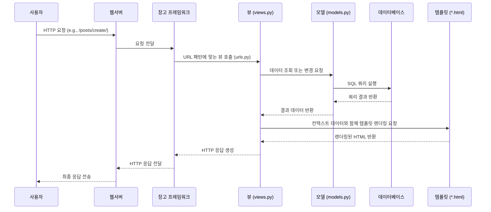

# 시퀀스 다이어그램

## 일반적인 요청 처리 흐름

```mermaid
sequenceDiagram
    participant Client as 사용자
    participant uWSGI as 웹서버
    participant Django as 장고 프레임워크
    participant View as 뷰 (views.py)
    participant Model as 모델 (models.py)
    participant Database as 데이터베이스
    participant Template as 템플릿 (*.html)

    Client->>uWSGI: HTTP 요청 (e.g., /posts/create/)
    uWSGI->>Django: 요청 전달
    Django->>View: URL 패턴에 맞는 뷰 호출 (urls.py)
    View->>Model: 데이터 조회 또는 변경 요청
    Model->>Database: SQL 쿼리 실행
    Database-->>Model: 쿼리 결과 반환
    Model-->>View: 결과 데이터 반환
    View->>Template: 컨텍스트 데이터와 함께 템플릿 렌더링 요청
    Template-->>View: 렌더링된 HTML 반환
    View-->>Django: HTTP 응답 생성
    Django-->>uWSGI: HTTP 응답 전달
    uWSGI-->>Client: 최종 응답 전송
```
