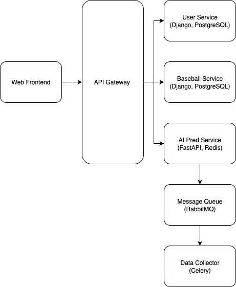

### **[프로젝트 기획서] tothe_ballpark: AI 기반 KBO 경기 예측 및 데이터 플랫폼**

---

### **1. 프로젝트 개요 (Project Overview)**

*   **프로젝트명:** tothe_ballpark
*   **부제:** AI 기반 KBO 경기 예측 및 데이터 플랫폼
*   **한 줄 요약:** KBO 리그의 방대한 데이터를 수집/가공하여, AI 모델을 통해 경기 결과를 예측하고 사용자 맞춤형 데이터를 제공하는 MSA 기반 백엔드 시스템
*   **핵심 목표:**
    1.  **대규모 트래픽 처리:** 실시간 경기 상황 및 다수 사용자의 동시 요청을 안정적으로 처리할 수 있는 확장 가능한 아키텍처 설계
    2.  **데이터 파이프라인 구축:** 정형/비정형 경기 데이터를 수집, 정제, 가공하여 분석 및 AI 모델 학습에 활용 가능한 형태로 제공
    3.  **MSA(Micro-Service Architecture) 도입:** 기능 단위의 독립적인 서비스 개발 및 배포를 통해 유지보수성과 개발 효율성 극대화
    4.  **CI/CD 파이프라인:** `GitHub Actions`를 활용한 빌드/테스트/배포 자동화 구축

### **2. 목표 시스템 아키텍처 (Target Architecture)**

안정적이고 확장 가능한 서비스 제공을 위해 다음과 같은 시스템 아키텍처를 목표로 합니다.

*   **API Gateway:** 모든 클라이언트 요청의 진입점. 인증, 로깅, 라우팅 등 공통 기능 처리.
*   **User Service (MSA #1):** 회원가입, 로그인, 마이페이지 등 사용자 관련 기능 담당.
*   **Baseball Service (MSA #2):** 경기 정보, 선수 데이터, 구단 순위 등 야구 관련 핵심 데이터 제공.
*   **AI Prediction Service (MSA #3):** 경기 예측 결과, 선수 퍼포먼스 예측 등 AI 모델 기반 데이터 제공. `Redis`를 통해 예측 결과를 캐싱하여 빠른 응답 속도 보장.
*   **Message Queue & Data Collector:** `RabbitMQ`와 `Celery`를 사용하여 KBO 사이트에서 경기 데이터를 주기적으로 크롤링하는 등 시간이 오래 걸리는 작업을 비동기적으로 처리. 시스템 부하 감소.

### **3. 단계별 개발 및 고도화 계획 (Phased Development Plan)**

현재 프로젝트를 실제 서비스 수준의 기술 스택으로 전환하고 발전시키는 로드맵입니다.

#### **Phase 1: 기반 다지기 (Foundation)**

*   **목표:** `PostgreSQL` 도입 및 개발 환경 구성.
*   **세부 계획:**
    1.  **DB 마이그레이션:** `SQLite` -> `PostgreSQL`로 데이터베이스 변경.
        *   **이유:** 현재 데이터의 양이 적더라도, 데이터의 **관계와 프로젝트의 최종 목표**를 고려할 때 PostgreSQL로의 전환은 필수적입니다. 이는 단순히 미래를 위한 준비를 넘어, **지금 당장 '더 올바른 방식'으로 데이터를 다루기 위함**입니다.
            *   **데이터 무결성 보장:** PostgreSQL의 엄격한 외래 키(Foreign Key) 제약 조건은 회원 탈퇴 시 관련 게시글을 자동으로 삭제하는 등, 데이터 간의 관계가 깨지는 것을 원천적으로 방지하여 시스템의 안정성을 높입니다.
            *   **복잡한 분석 능력 확보:** '특정 팀 간의 경기에서 특정 조건을 만족하는 선수'를 찾는 등, 여러 테이블을 JOIN하는 복잡한 쿼리나 윈도우 함수(Window Functions)를 지원하여, 단순 조회를 넘어 깊이 있는 데이터 분석 기능을 구현할 수 있습니다.
            *   **미래 확장성 확보:** 여러 서비스가 하나의 중앙 DB에 접속해야 하는 MSA 구조는 파일 기반인 SQLite로는 구현이 불가능합니다. 지금 PostgreSQL을 도입하는 것은 미래에 발생할 기술 부채를 예방하는 현명한 결정입니다.
    2.  **인증 시스템 고도화:** `djangorestframework-simplejwt`를 사용한 토큰(JWT) 기반 인증 시스템 구현.
        *   **이유:** 세션 방식과 달리 상태를 저장하지 않아(Stateless) MSA 환경에 적합하며, 웹/모바일 등 다양한 클라이언트를 지원하는 현대적인 인증 방식입니다.
    

#### **Phase 2: 성능 최적화 (Performance Optimization)**

*   **목표:** `Redis` 도입을 통한 응답 속도 개선 및 서버 부하 감소.
*   **세부 계획:**
    1.  **캐싱(Caching) 전략 도입:** `Redis`를 캐시 저장소로 활용.
        *   **대상:** 자주 변경되지 않지만 요청 빈도가 높은 데이터 (예: 구단 순위, 경기 일정, 선수 프로필).
        *   **구현:** Django의 `cache_page` 데코레이터나 `low-level cache API`를 활용하여 API 응답 캐싱.
        *   **이유:** DB 조회 횟수를 획기적으로 줄여 API 응답 시간을 단축하고, 사용자에게 쾌적한 서비스 경험을 제공합니다.

#### **Phase 3: 비동기 처리 및 MSA 전환 준비 (Asynchronous Tasks)**

*   **목표:** `Celery`와 `RabbitMQ`를 도입하여 시간이 많이 소요되는 작업을 비동기적으로 처리.
*   **세부 계획:**
    1.  **비동기 작업 정의:**
        *   **대상:** 매일 자정마다 전날 경기 데이터 및 선수 스탯을 크롤링하고 계산하는 작업.
        *   **구현:** `Celery` Task로 정의하고, `RabbitMQ`를 메시지 브로커로 사용하여 작업을 전달.
        *   **이유:** 무거운 작업을 백그라운드에서 처리하여 API 서버가 사용자 요청에만 집중할 수 있도록 시스템 부하를 분산시킵니다.

#### **Phase 4: CI/CD 파이프라인 구축 (Automation)**

*   **목표:** `GitHub Actions`를 활용하여 테스트 및 배포 프로세스 자동화.
*   **세부 계획:**
    1.  **CI (Continuous Integration):**
        *   `main` 브랜치에 코드가 Push/Merge 될 때마다 자동으로 `pytest` 실행.
    2.  **CD (Continuous Deployment):**
        *   (심화) 서버에서 최신 코드를 Pull 받아 자동으로 재배포하는 스크립트 실행.
        *   **이유:** 개발 생산성을 높이고, 수동 배포 과정에서 발생할 수 있는 실수를 방지하여 안정적인 서비스 운영을 보장합니다.

### **4. 기술 스택 (Technology Stack)**

| 구분 | 기술 | 사용 이유 | 
| :--- | :--- | :--- |
| **Backend** | Python 3.9+, Django, Django REST Framework | 높은 생산성과 방대한 라이브러리 생태계를 가진 현대적인 백엔드 개발 언어. |
| **Database** | PostgreSQL | 높은 안정성과 데이터 무결성을 보장하는 오픈소스 관계형 데이터베이스. |
| **Cache** | Redis | 메모리 기반의 빠른 Key-Value 저장소로, 캐싱을 통해 시스템 성능을 극대화. |
| **Message Queue**| RabbitMQ | 안정적인 메시지 전달을 보장하는 대표적인 오픈소스 메시지 브로커. |
| **Async Tasks** | Celery | Python 환경에서 분산 비동기 작업을 처리하기 위한 표준 라이브러리. |

| **CI/CD** | GitHub Actions | 코드의 빌드, 테스트, 배포를 자동화하여 개발 워크플로우를 효율화. |
| **Project Mgt.**| GitHub Projects / Issues | 칸반 보드 스타일의 이슈 관리를 통해 체계적인 프로젝트 진행. |

### **5. 기대 효과**

*   **안정적이고 확장 가능한 서비스 기반 마련:** MSA, 비동기 처리, 캐싱 전략을 통해 대규모 트래픽에도 안정적인 서비스를 제공하고, 향후 기능 확장에 유연하게 대처할 수 있는 기술적 기반을 확보합니다.
*   **데이터 기반의 고도화된 서비스 제공:** 정제된 데이터를 기반으로 AI 예측 모델을 구축하여, 타 서비스와 차별화된 독창적인 콘텐츠와 사용자 경험을 제공할 수 있습니다.
*   **효율적인 개발 및 운영 문화 구축:** CI/CD 파이프라인을 통한 배포 자동화는 개발 생산성을 향상시키고, 안정적인 서비스 운영을 가능하게 합니다.

### **6. 보안 강화 계획 (우선순위 포함)**

**현황 메모**
- Prod: `SECURE_SSL_REDIRECT`, `HSTS`, `CSRF_COOKIE_SECURE`, `SESSION_COOKIE_SECURE` 적용. DRF 사용 시작.
- DB: PostgreSQL 사용. ORM 위주 코드이며 raw SQL 사용 흔적 없음(`rg "raw\\(|execute\\("` 2025-12-09 기준).

**우선순위 0 (즉시) — SQL Injection/계정 정보 노출 방지**
- ORM 원칙 준수: raw SQL, `.extra()`, 수동 커서 금지. 불가피 시 파라미터 바인딩 필수.
- DB 계정 최소 권한: 앱용 전용 계정(SELECT/INSERT/UPDATE/DELETE만) 사용, SUPERUSER/DDL 권한 분리. 비밀번호 주기 교체.
- 입력 검증: 모든 입력(쿼리파라미터/폼/바디)에 대한 밸리데이션 유지. DRF Serializer, Django Form을 기본 경로로 사용.
- 로깅 점검: 요청/응답/쿼리 로그에 민감 정보(비밀번호, 토큰, 세션ID) 남지 않도록 확인.
- 점검 기록: 정기적으로 `rg "raw\\(|execute\\("` 등으로 수동 검색 후 기록.

**우선순위 1 — 관리자/인증 강화**
- Django superuser 1개 생성(강한 패스워드, MFA 지원 시 적용) → `/admin` 접근은 IP ACL/nginx로 제한.
- 세션/쿠키 설정: `SESSION_COOKIE_HTTPONLY=True`, `CSRF_COOKIE_SAMESITE='Lax'`(Prod) 명시.
- 로그인 시도 제한/봇 대응: django-axes(or nginx rate limit), 필요 시 reCAPTCHA 적용.

**우선순위 2 — 전송/헤더 보강**
- HTTPS만 노출(80→443 리다이렉트). HSTS 유지.
- 보안 헤더 추가: `X-Content-Type-Options: nosniff`, `X-Frame-Options: DENY 또는 SAMEORIGIN`, `Referrer-Policy: strict-origin-when-cross-origin`, `Content-Security-Policy`(스크립트/스타일/이미지 도메인 화이트리스트).

**우선순위 3 — API 토큰/권한**
- 외부 클라이언트용 JWT(SimpleJWT) 도입: `token/obtain/`, `token/refresh/`, access 짧게/refresh 길게.
- DRF Throttling 설정(익명/인증 구분) 및 Permission 기본값 최소화.

**우선순위 4 — 업로드/입력 경로 하드닝**
- 파일 업로드: 확장자·MIME 검증, 용량 제한, 이미지 리사이즈 후 저장. 실행 권한 제거된 디렉터리 사용.
- 에러 응답: 스택트레이스/쿼리 노출 금지, 공통 에러 핸들러로 메시지 최소화.

**우선순위 5 — 운영/모니터링**
- 로그 중앙화 및 알림: 로그인 실패 누적, 관리자 로그인, 4xx/5xx 급증 알림.
- 백업/복구 리허설: DB/미디어 주기 백업 + 복원 테스트, 전송·저장 시 암호화 확인.

**즉시 작업 제안**
1) DB 계정 권한 분리 및 비번 교체(앱용 최소권한 계정 사용).  
2) 코드베이스 raw SQL 사용 재점검(2025-12-09 검색 시 없음). 신규 개발 시 ORM 강제 가이드 배포.  
3) Django superuser 생성 후 `/admin` IP 제한.  
4) Prod 설정에 `SESSION_COOKIE_HTTPONLY=True`, `CSRF_COOKIE_SAMESITE='Lax'` 명시 검토.  
5) nginx 보안 헤더 세트 적용(CSP·nosniff·frame옵션 등).
